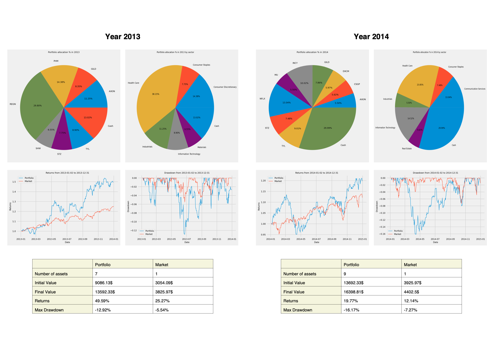

# PortFin - Portfolio Optimization and Backtesting



## Project Overview

PortFin is a project designed to compare the performance of dynamically allocated investment portfolios with the market, S&P500. It leverages historical data of the assets of the S&P500 to generate new portfolios each year and allocates assets accordingly. All the information are then compiled into a PDF report.

### Results

Some benchmark results are saved in the `exemples` folder.

## Usage

To run PortFin, use the following command:

```bash
python main.py [-h] [-y YEARS] [-w WINDOW] [-o OPTIMIZER] [-t TYPE] [-g GAMMA] [-m MONEY] [-r REINVEST] [-n NAME] [-f] [-F] [-W WEIGHT]
```

### Options

- `-h, --help`: Show the help message and exit.

- `-y YEARS, --years YEARS`: Specify the number of years of data to download.

- `-w WINDOW, --window WINDOW`: Set the number of years needed to backtest the stock.

- `-o OPTIMIZER, --optimizer OPTIMIZER`: Choose the optimizer to use (hierarchical or efficient). The default is hierarchical.

- `-t TYPE, --type TYPE`: Specify the objective to use (max_sharpe or min_volatility). The default is max_sharpe. (Note: this option is only available for the efficient optimizer.)

- `-g GAMMA, --gamma GAMMA`: Set the regularization parameter. The default value is 0.1.

- `-m MONEY, --money MONEY`: Specify the initial investment amount. The default is $1000.

- `-r REINVEST, --reinvest REINVEST`: Set the amount of money to reinvest each year. The default is $0.

- `-n NAME, --name NAME`: Specify the name of the PDF report. The default is "report.pdf."

- `-f, --full`: Enable this option to generate a full report. By default, this option is set to False.

- `-F, --force`: Enable this option to force a reload of the ticker data. By default, this option is set to False.

- `-W WEIGHT, --weight WEIGHT`: Set the minimum weight of each asset. The default is 0.05.
